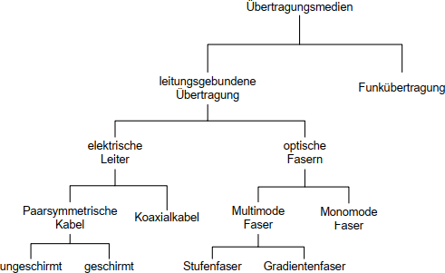
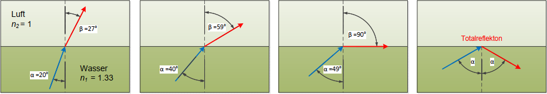
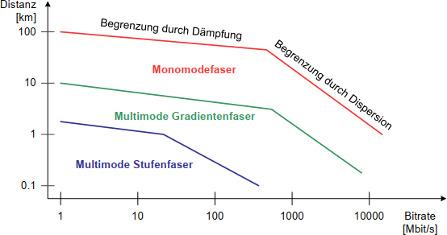
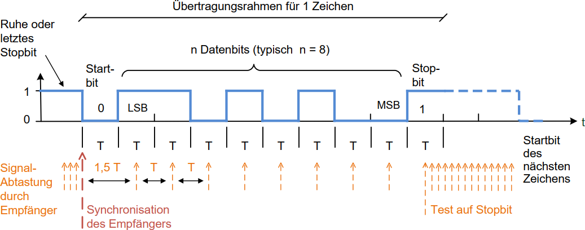
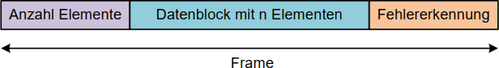
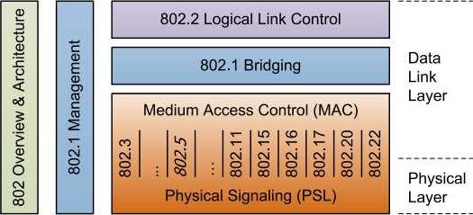
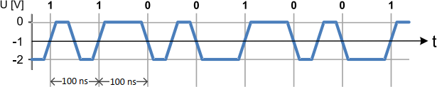
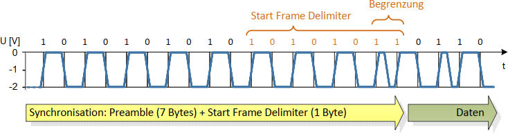
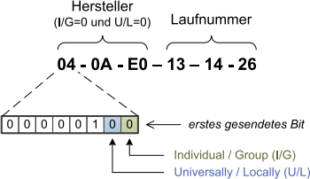
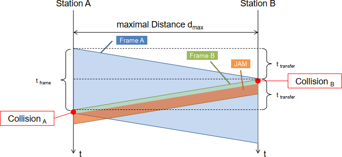

@import "styles.less"

# Zusammenfassung KT

## Inhaltsverzeichnis {ignore=true}
[TOC]

## OSI-Referenzmodell

Peer-to-peer Protokolle zwischen gleichgestellten Schichten.
Anbieten der Dienste für die nächsthöhere Schicht.

### Physical Layer
Das Übertragungsmedium ist nicht teil des OSI-Modells. Der Physical Layer ist, wie jede andere Schicht, austauschbar. Kupferkabel kann mit Glasfaser ausgetauscht werdem, ohne Rückwirkung auf den Data Link Layer.

### Data Link Layer
Für _Punkt-Punkt-Verbindungen_ zwischen genau _zwei_ Teilnehmern:
- Realisieren einer sicheren Verbindung. Z.B. Fehlererkennung/-korrektur
- Aus-/Verpacken der Datenblöcke für Network Layer
- Flow Control. (nicht schneller Senden als Empfangen)

Im LAN:
- Adressierung der Teilnehmer (Medium Access Control Address, MAC-Address)
- Steuerung des Zugriffs auf das Medium (falls nicht Full-Duplex)

Der Transport Layer macht ähnliches aber auf Netzwerkebene.

### Network Layer
Der Network Layer ermöglicht den Datenaustausch auf einheitliche Weise. Dazu wird Adressierung und Routing verwendet.

**Verbindungsorientierter Dienst**
Alle Pakete werden über den gleichen Pfad geroutet. Dazu wird eine Verbindungsnummer gespeichert.

- Zeitverlust und Zusatzaufwand für den Aufbau der Verbindung. 
- Geforderte Charakteristik (Durchsatz, Delay, Verlust) besser einhalten
- Reihenfolge der Daten bleibt erhalten
- Lastverteilung durch Wahl der Route
- Jeder Knoten braucht einen Eintrag pro Verbindung

**Verbindungsloser Dienst (Datagram)**
Wie Briefpost. Das Paket wird unabhängig von anderen Paketen versendet. (Pfad kann gleich sein, muss aber nicht). Jeder Knoten muss wissen an welchen Ausgang das Paket versendet werden soll, damit es das Ziel erreicht => Routing-Tabelle.

IP ist ein Beispiel eines verbindunslosen Dienstes.

- bei Unterbruch oder Überlastung einfach erneut senden
- Reihenfolge wird falls nötig durch Transport Layer wiederhergestellt

### Transport Layer
Höchste Schicht des Transportsystems und biete Prozessen des Session Layers einen effizienten Datentransport.
Für Transit-Knoten (zwischen Anfangs- und Endknoten) wird die Schicht nicht benötigt.

- User Data Protocol (UDP): verbindungslos, unsicher
- Transmission Control Protocol (TCP): verbindungsorientierter, sicher

### Session Layer
Auf- und Abbau von Sitzungen
Falls Transportverbindung zusammenbricht, muss z.B. neue Verbindung hergestellt werden.
"Verwaltung der Transportschicht"

### Presentation Layer
Stellt Dienste zur Darstellung der zu übertragenen Daten zur Verfügung. Beispiel:
- Codierung von Zeichen von/zu ASCII, Unicode, ISO, etc.
- Fliesskommazahlendarstellung

### Application Layer
Legt das Bindeglied zur Anwendung fest:
- FTP
- SMTP
- HTTP
- DNS

### Kritik
Aus heutiger Sicht fehlen wichtige Themen wie:
- Daten-Sicherheit und - Verschlüsselung
- Hochverfügbarkeit und Redundanz
- Netzwerk-Management (Überwachung und Steuerung)
- Zeitsynchronisation

Diese Punkte lassen sich zwar im OSI-Modell irgendwie unterbringen, wurden aber ursprünglich nicht adressiert.

## Übertragungsmedien

Wichtigste Eigenschafen:
- Erreichbare Distanz
- maximale Datenübertragungsrate

### Ausbreitungsgeschwindigkeit
In Materien (egal ob Glas oder Metall):
$C_{Medium} = 200'000 \ km/s \approx \frac{2}{3}c$

### Signaldämpfung und Dämpfungsbelag
Die Signaldämpfung ist die Leistungsabnahme eines Signals und beschränkt die erreichbare Distanz.

Signaldämpfung in Dezibel und Eingangsleistung $P_1$, Ausgangsleistung $P_2$

Signaldämpfung $[dB] = 10 \cdot \log(\frac{P_1}{P_2})$

Mittels Spannung:

Signaldämpfung $[dB] = 2 \cdot 10 \cdot \log(\frac{U_1}{U_2})$

**Dämpfungsbelag**
Signaldämpfung pro Distanz $[dB / 100m]$ oder $[dB / km]$

### Koaxialkabel
Verwendung: Punkt-Punkt-Verbindungen Hochgeschwindigkeitsnetz (10, 40, 100 GBit/s)
- gut für Übertragung hochfrequenten Signalen
- kleiner Dämpfungsbelag => hohe Distanzen
- speziell Twinax-Kabel, Aderpaare einzeln geschirmt

### Twisted Pair
- Verdrillte Aderpaare
- Un-/Shielded Twisted Pair, STP vs. UTP 

**Schirmung**
_x_/yTP

_x_ Gesamtschirmung
_y_ Aderpaarschirmung

U = ungeschirmt
F = Folienschirm
S = Geflechtschirm
SF = Schirm aus Geflecht und Folie (nur Gesamtschirmung)

#### Störungen
Störungen von Datenleitungen werden als _Übersprechen oder Nebensprechen (Crosstalk)_
bezeichnet.

**Differenzverstärker**
gegen kapazitive Kopplung

_Induktiv eingekoppelte Störungen_ können mit Differenzverstärker oder Schirmen nicht beseitigt werden, da die Störungen ein komplementäres Signal erzeugen.

Durch die Verdrillung kann dies aber minimiert werden.
_Bilder nötig?_

#### Kabelkategorien und Stecker
- Kategorie 1-4: Für Telefon und Modem nicht moderne LAN (0.4/4/16/20MHz Bandbreite)
- Kategorie 5: Weit verbreitet und akzeptiert. (100 Mhz, 1 Gbit/s, 100 m)
- Kategorie 6: 250 MHz für Gigabit Ethernet
- Kategorie 7: 600 MHz 10 GBit/s, (spezielle Stecker und S/FTP Kabel)

Praxistipps Gebäudeverkabelung
- Enden mit Abschlusskappen versehen
- Einhaltung der Lagerungs- und Verlegetemperaturen
- Einhalten von zulässigen Biegeradien und Zugkräften
- Kabel nicht verdrehen oder quetschen
- Einsatz geeigneter Werkzeuge

**Pin-Layout des RJ45-Steckers und Bezeichnung der Aderpaare**

@import "rj45.png" {.asdf}

### Lichtwellenleiter
- Vollständige Unempfindlichkeit gegen elektromagnetische Störungen
- Kleine Signaldämpfung und somit grosse Distanzen
- Grosse Bandbreiten und somit grosse Übertragungsraten

Brechungsindex des Kerns muss leicht höher sein las der des Mantels.
Z.B. 1.50 und 1.48.

**Brechung und Totalreflexion**

$n_1 \cdot \sin(\alpha) = n_2 \cdot \sin(\beta)$

$\displaystyle \alpha = \arcsin(\sin(\beta) \cdot \frac{n_2}{n_1})$

Totalreflexion wenn $\beta \ge 90 \degree$

**Einteilung LWL**

Dämpfung durch Absorption, Dispersion = Verzerrung des Signals

**Multimode Glasfaser**
Stufen- vs. Gradientenfaser 
TODO

**Monomode Glasfaser**
Sehr kleinen Kern. Unterdrückt fasst alle Moden bis auf einen. (10 Gbit/s, 80km; 100 Gbit/s, 40km)

### Strukturierte Gebäudeverkabelung
TODO

## Physical Layer
- elektrische Eigenschaften (Pegel, Zeiten, etc.)
- Codierung (Return to Zero, non return to Zero, AMI, Manchester, FSK, etc.)
- mechanische Eigenschaften (Stecker, Pinbelegung, etc.)

Faktoren welche den Physical Layer beeinflussen:
- Übertragungsmedium
- Kopplung der Kommunikationspartner
- Übertragungsverfahren

### Kopplung der Kommunikationspartner
- Simplex: nur eine Richtung (z.B. Radio, TV)
- Halbduplex: Beide Richtungen aber nicht gleichzeitig (z.B. Funkgerät)
- Vollduplex: Beide Richtungen 1 Kanal, beide gleichzeitig, z.B. Telefon

nicht scharf: Zeitmultiplex ist technisch Halbduplex, aber wirkt wie Vollduplex.

Verbindungsarten:
- Punkt-Punkt: direkte Verbindung A-B (PC und USB-Drucker)
- Shared Medium: Mehrere Knoten über gleiches Medium (Bus, LAN)

### Übertragungsverfahren
- parallele Übertragung: Mehrere Leitungen, gleichzeitig (parallele) Signale übertragen
- seriell synchron und asynchron

**Serielle asynchrone Übertragung**
- kein Takt für Bitsynchronisation
- Empfänger justiert sein Takt andauernd, tastet nach Stopbit ab für nächstes Startbit
- Bitrate, Anzahl Datenbits und Anzahl Stopbits vorher vereinbaren

- sehr einfache Implementation
- Start/Stopbit verringern aber Nettobitrate
- nicht sehr robust (Bitfehler)

**Serielle synchrone Übertragung**
- Empfänger synchron mit Sender
- hohe Datenraten (keine Start- / Stopbits)
- Takt muss mitgegeben werden (separat oder Codierverfahren, um Takt zu extrahieren)
- Data Link Layer trennt die einzelnen Bytes

### Leitungscodes
- physikalisch vorhandene Bandbreite effizient nutzen
- unabhängig von übertragenen Daten eine zuverlässige Taktrückgewinnung ermöglichen
- möglichst gleichspannungsfrei sein

Leitungseinrichtung codiert die Daten in den Leitungscode.
Der Empfänger decodiert und kann Taktrückgewinnung machen.

**Alternate Mark Inversion (AMI)**
Logischer Wert 0 mit 0 Volt.
Logischer Wert 1 alternierend mit positiver/negativer Spannung

**HDB3 mit 000V-Sequenzen**
AMI aber vier Nullen werden zu 0001 (1 genau gleich, nicht alternierend, wie das letzte 1). Dies ist für die Taktrückgewinnung und wird vom Empfänger wieder zu 0000 konvertiert.

Da dieser Code bei langen Nullfolgen nicht gleichspannungsfrei ist, wird eine B00V-Sequenz verwendet:
Wenn die gesendete Anzahl von Einsen seit der letzten Regelverletzung gerade ist, sende 1001.

### Nutzung der Bandbreite
Übertragunsrate hängt von folgendem ab:
- Bandbreite der Übertragunsstrecke
- Stärke des Signals vgl. mit Störungen

**Symbolrate (Nyquist Rate)**
Der Empfänger kann anhand des Zustands des Übertragungsmediums die übertragene Information
ermitteln (Dekodierung). Dieser Zustand = _Symbol_

Anzahl von Zustandsänderung pro Zeit = Symbolrate (in Baud)
!= Bitrate !!!

Maximale Symbolrate $f_s$ abhängig der Nutzbaren Bandbreite $B$ in Hertz.

$f_s \le 2B$

ADSL/ISDN wichtig?

**Maximal erreichbare Bitrate (Hartley's Gesetz)**
Die maximal erreichbare Bitrate ist das Produkt der Symbolrate und dem Informationsgehalt der Symbole.

$M =$ Anzahl erkennbare Zustände
$A =$ Grösse des Signals (Amplitude)
$\Delta V =$ Ungenauigkeit des Empfängers bzw. Störungen
$I_S =$ Informationsgehalt eines Symbols
$R =$ Maximal erreichbare Bitrate

$\displaystyle M = 1 + \frac{A}{\Delta V}$

$I_S = \log_2(M)$

$\displaystyle R \le 2B \cdot \log_2(M) = 2B \cdot \log_2(1 + \frac{A}{\Delta V})$

Z.B. AMI-Code
Dreiwertig ($U_+, 0, U_-$) $\Rightarrow \log_2(3) = 1.58\ Bit$
Pro Schritt wird aber nur 1 Bit übertragen, d.h. Effizienz von $\frac{1}{1.58} = 63\ \%$

**Gesetz von Shannon-Hartley**
$C$ | Kanalkapazität
$B$ | Bandbreite
$S$ | Signalleistung
$N$ | Rauschleistung

$\displaystyle C = B \cdot \log_2(1 + \frac{S}{N})$

Faktor 2 fehlt, da $\frac{S}{N}$ ein Verhältnis von Leistungen ist, die quadratisch mit den Spannungen zusammenhängen.

$\displaystyle M = \sqrt{1 + \frac{S}{N}}$

## Data Link Layer
Bei Punkt-Punkt-Verbindungen:
- Massnahmen zur Fehlererkennung und -korrektur
- Ver- und Auspacken der Frames (Framing)
- Frame-Erkennung
- Flow-Control

Bei mehreren Teilnehmern:
- Adressierung der Teilnehmer
- Medium Zugriff

**Asynchrone Übertragung**
Übertragung nur bei Bedarf. Startbits markieren den beginn eines Frames. Pause zwischen Frames.

Frames bestehen normalerweise aus Header, Daten, und Prüfbits:

**Synchrone Übertragung**
Laufend Frames senden ohne Unterbruch. Leer-Frames, wenn keine zu sendenden Daten vorhanden.
Es müssen im Gegensatz zur asynchronen Übertragung auch die Byte-Grenzen erkannt werden.

Start- und End-Flags für Anfang und Ende eines Frames. (Spezielles Bitmuster)
Bitstopfen, damit das Bitmuster nicht in der Mitte des Frames auftritt.
Nach 5 aufeinanderfolgenden Einsen eine Null.

### Frame-Länge
Je länger die Frames, desto besser die Nettobitrate.
$\displaystyle \text{Nettobitrate} = \text{Bruttobitrate} \cdot \frac{\text{Nutzdaten}}{\text{Nutzdaten} + \text{Header}}$

aber:
- Wahrscheinlichkeit eines Übertragungsfehlers ist grösser
- Datenverlust grösser, wenn Fehler auftritt
- Wahrscheinlichkeit, dass ein Fehler nicht entdeckt wird ist grösser
- Jitter: Variation der Zeitabstände zwischen Frames höher

**Jitter**
Lange Frames blockieren die Übertragungsstrecke für längere Zeit. Problem z.B. bie Multimedia Applikationen.
Unregelmässige Updates.

**Durchsatz**
$\text{Frame-Erfolgswahrscheinlichkeit} = (1 − p_e)^N$
$\text{Frame-Fehlerwahrscheinlichkeit} = 1 - (1 − p_e)^N$

Optimaler Durchsatz bei BER $p_e = 10^{-4}$ und Header-Länge $200 \text{ Bit}$ bei Frame-Länge $1500 \text{ Bit}$

Optimale Frame-Länge $\displaystyle \approx \sqrt{\frac{H}{p_e}}$ wobei $H =$ Header-Länge

### Fehlererkennung und -korrektur
- Backward Error Correction: Empfänger erkennt Fehler, fordert Retransmission. BER klein
- Forward Error Correction: Empfänger erkennt und korrigiert Fehler. BER grösser

**Erkennung**
Prüfbitgenerator CRC stuff

Erkennbare Fehler $e$ mit einer Hamming-Distanz $h$:

$e = h - 1$

Other Error stuff TODO

### Flow control
1. Sender produziert mehr Daten als Empfänger verarbeiten kann => Problem
2. Empfänger sendet Stopp-Meldung
3. Wenn die untere Limite wieder erreicht wurde, sendet der Empfänger eine Start-Meldung

Es gibt auch die Methode jeweils eine "Quittung" zurückzuschicken (wie bei TCP)

Wichtig ist, dass der Data Link Layer alleine das Problem nicht lösen kann, da die Daten nochmals gesendet und somit generiert werden müssen.

### Medium Zugriff
Mehrere Verfahren für Media Access Control. 

**Master/Slave-Verfahren**
1. Master fragt zyklisch jeden Slave an.
2. Slave antwortet an Master.
3. Master speichert Daten ab
4. Master sendet an Slave.

Vorteile:
- sehr einfach Slaves an-/abzuhängen
- Zeit zwischen Slave-Zugriffen voraussehbar (deterministisch)

Nachteil ist, dass die Transferzeit hoch ist, da immer über den master gesendet werden muss.

**Token Passing**
Ein Token wird zwischen gleichberechtigten Knoten in festgelegter Reihenfolge weitergereicht.
Man darf nur senden, wenn man den Token hat.

Vorteil: deterministisch und besser wie Slave, weil die Knoten direkt miteinander kommunizieren können.
Nachteile: 
- Relativ aufwändig Knoten hinzuzufügen oder abzubauen.
- Was wenn Token verloren geht?

Anwendung: Token-Ring

Kann auch Frame Passing verwenden:
1. Master schickt ein "leeres" Frame. Für die Slaves ist jeweils Platz im Frame reserviert.
2. Slave erhält das Frame, füllt Daten ein
3. Sendet das Frame weiter (an nächsten Knoten)

**Zeitgesteurter Zugriff**
Analog Taktfahrplan im Bahnnetz. Vorteil: sehr fair. Nachteil: ist Planung. Fahrplan muss in jedem Knoten vorhanden sein.

**Carrier Sense Multiple Access (CSMA)**
Alle Knoten gleichberechtigt
1. Knoten schaut ob Bus frei.
2. Wenn frei, dann senden
   1. Sonst, warten, bis frei ist

Vorteil: kein Master, keine Konfiguration/planung
Nachteil: nicht deterministisch, und Was wenn gleichzeitig senden? Was wenn einzelner Knoten immer sendet?

**Carrier Sense Multiple Access / Collision Detection (CSMA/CD)**
1. Knoten erkennen Kollisionen
2. Warten zufällige Zeit
3. Senden erneut

**Carrier Sense Multiple Access with Collision Resolution (CSMA/CR)**
ein Signalpegel wird als dominant definiert und gewinnt im Konfliktfall.
Der Verliere stellt die Kollision fest und bricht seine Übertragung ab.

Keine Übertragungskapazität geht verloren, aber es muss innerhalb einer Bitzeit erfolgen.

### Layer-2-Protokolle
Folgende Layer-2-Protokolle werden eingesetzt:
- High Level Data Link Control (HDLC)
  Von ISO und ITU genormtes Protokoll, das in vielen Anwendungen anzutreffen ist.
- Point to Point Protocol (PPP = HDLC-Variante)
  Protokoll zur Anbindung von abgesetzten Teilnehmern an einen Internet Provider.

## Lokale Netzwerke (LAN)
Ein LAN ist ein räumlich begrenztes Netzwerk.

### Topologie
Es gibt verschiedene Topologien. Heutzutage werden jedoch meist Baumtopologien eingesetzt.

**Bustopologie**
Knoten sind passiv am Medium angeschlossen und werden nur im Sendefall aktiv.

**Linientopologie**
Benachbarte Knoten sind mit Medium verbunden. In der Automation z.B. sehr beliebt.
Problem wenn einzelner Knoten ausfällt: A - B - C => A - ~~B~~ - C, a kann nicht mehr C erreichen und umgekehrt.

**Ringtopologie**
Wie Linientopologie - einfach Enden zusammenhängen
Doppel-Ringtopologie auch gut, als Fallback zum einfachen Ring, falls was ausfällt.

**Sterntopologie**
Knoten sind direkt an einen Verteiler (Hub/Switch) angeschlossen.
Knoten können einzeln ausfallen, aber Verteiler darf nicht.

**Baumtopologie**
Wie Sterntopologie aber Verteiler mit anderen Verteilern verbinden.

### Übertragungsarten
3 Gruppen
- Unicast-Übertragung
  Transfer von Quelle zu _genau einem_ Ziel im Netzwerk.
- Broadcast-Übertragung
  Transfer von Quelle zu _allen_ Knoten eines Netzwerks. (Netzwerk wird belastet, auch wenn Pakete für einige Knoten nicht wichtig sind)
- Multicast-Übertragung
  Transfer an _eine bestimmte Gruppe_ von Knoten im Netzwerk. Sender versieht Paket mit Multicast-Adresse. Protokoll nötig, um sich in eine Gruppe ein/austragen zu können.

### Normung LAN und MAN
IEEE entwickelt und normiert LANs und MANs.

ANSI/IEEE | Beschreibung
- | -
802.3  | Ethernet
802.11 | Wireless LANs (WiFi)
802.15 | Wireless PANs (Bluetooth, ZigBee etc.)
802.16 | Broadband Wireless MANs (WiMAX)
802.17 | Resilient Packet Rings (MAN)
802.20 | Mobile Broadband Wireless Access
802.22 | Wireless Regional Area Networks

Ethernet von 10 Mbit/s - 100 Gbit/s

### Shared Ethernet
Im Standard erstmals mit 10 MBit/s.

**Physical Layer 10BASE5 und 10BASE2**
Bis 500m, Koaxialkabel wird angebohrt und Transceiver befestigt.
Von Transceiver Kabel zum Knoten.

Danach 10BASE2, welches mit BNC-T-Stücken arbeitet und billiger ist.
Die BNC-Stecker sind aber empfindlich und haben sich nicht bewährt.

**Leitungscodierung und Manchester-Code**
keine Trägerfrequenz, 1 Symbol alle 100ns

Beim Manchestercode werden die Flanken und nicht die Zustände gelesen. 

=> einfache Taktrückgewinnung, benötigt aber höhere Frequenz (10 Mbit/s <> 10 MHz, Doppelte vom theoretischen Minimum)

Asymmetrisches Signalpegel von $0\ V$ und $-2\ V$. Mit symmetrischen Pegeln ist er gleichstromfrei (10BASE-T)

**Preamble und SFD**

**Senden (ohne Kollision)**
1. Warten bis Übertragungskanal frei
2. Frame an Physical Layer übergeben
   1. Preamble und SFD senden
   2. Daten senden
   3. Kontrolle des Signalpegel auf Kollisionen (Überlagerung Sendesignale) und Mitteilung an Data Link Layer
3. Meldung an übergeordnete Schichten

**Empfang (ohne Kollision)**
1. Nicht sendende Knoten melden Data Link Layer, nicht zu senden.
2. Alle Knoten werden zu Empfänger und übersetzen Manchester-Code
3. Falls Zieladresse der eigene Knoten => Datenteil an Data Link Layer übergeben

**Empfang (mit Kollision)**
Nur zu Beginn der Übertragung.
1. Kollision meldet Physical Layer mittels "collision detect signal"
2. Jam-Signal (32-Bit, random Inhalt) senden
3. Datalink Layer kann durch Prüfsumme falsches Frame unterscheiden
4. Sender wartet variable Zeit.

Zeit zu warten ist ein _Vielfaches der Slot-Zeit_ $t_s$, die 512 Bitzeiten entspricht:
10 Mbit/s Ethernet $t_s = 51.2 \mu s$, 100 Mbit/s $t_s = 5.12 \mu s$
1. Kollision $0 \cdot t_s$ oder $1 \cdot t_s$ bei nachfolgenden immer das doppelte der vorherigen.

### Aufbau Ethernet-Frames
LSB vor MSB

**Destination Address**
MAC-Adresse mit 6 Bytes, weltweit eindeutig

3 Bytes: Organizationally Unique Identifier (OUI), Herstellerspezifisch
3 Bytes: Vom Hersteller bestimmt, muss eindeutig sein

Ausnahmen sind Multicast- und Broadcast-Adressen

**Source Address**
MAC-Adresse des Senders. Das erste Bit muss 0 sein (Individuelle Adresse)

**Length / Type**
- Wert $\le 1500$ gibt die Anzahl von Bytes im Datenfeld "Data" an (ohne Fülldaten)
- Wert $\ge 1536$ welches höheres Protokoll im Datenfeld ist.

**Data / Pad**
Datenfeld mit Padding auf 64 Bytes wenn kleiner als 46.
=> minimale Frame-Länge 64 Bytes

**Frame Check Sequence (FCS)**
CRC32 Check Sequence

**Interframe Gap (IFG)**
minimaler zeitlicher Abstand zwischen Frames. Gehört zum Physical Layer.

### Repeater und Hubs
Länge der Bus-Segmente durch Dämpfung limitiert.
Signalverstärker = Repeater restauriert Amplitude sowie Preamble, Flanken und Jitter.
Hub = Multiport-Repeater

- Hub sendet Jam-Signal auf allen Segmenten, wenn Kollision entdeckt.
- Hub unterdrückt Signal falls länger als 5ms gesendet wird.

**Round Trip Delay**
Ein beliebiger sendender Knoten muss eine Kollision erkennen können, solange er noch am Senden ist.

**Interframe Gap Shrinkage**
Durch Repeater werden die Preamble länger und der IFG kürzer.

**Collision Domain**
Bereich des Netzwerks in dem eine Kollision erkannt werden kann heisst Collision Domain
Die Collision Domain darf nur halb so gross sein, wie die Ausdehnung des kürzesten Frames.

Die Bedingung für die Erkennung einer Kollision durch Knoten A ist:
$t_{frame} \gt 2 \cdot t_{transfer}$

Maximale Ausdehenung eines Segments:

$\displaystyle d_{max} \lt \frac{1}{2} \cdot \frac{\text{Framesize}_{min}}{\text{Bitrate}} \cdot C_{Medium}$

Wenn Repeater/Hubs verwendet werden, erhöht sich die Übertragungszeit $t_{transfer}$ entsprechend.

### Übungen
1. Nenne einen _typischen_ Vorteil der folgenden Topologien und ob sie heute noch allgemein eingesetzt wird.
   - Bus-Struktur
     _? keine Verteiler benötigt ?_
     _wird nicht mehr eingesetzt_
   - Baum-Struktur
     _Kleine Kollisionsdomäne mit Switches, hierarchisch aufbaubar_
     _wird allgemein eingesetzt_
   - Ring-Struktur
     _einfach erreichte Ausfallsicherheit, da Knoten mindestens 2 Mal angeschlossen werden_
     _wird nicht mehr eingesetzt_
2. Man nenne je _zwei_ typische Nach- oder Vorteile von CSMA/CD
   - Vorteile
     _Kollisionserkennung_
     _Kein Master für die Übertragung nötig_
   - Nachteile
     _nicht deterministisch_
     _?_
3. siehe oben
4. Abbildung 5.27 zeigt ein Ethernet-Signal (0.5µs/Division). Eingezeichnet sind die letzten 4 Bits des Start-Frame-Delimiters.
   - Zeichnung
   - doppelte spannung
   - Manchester-Code, Vorteile:
     - Kollisionen einfach erkennbar
     - Kann gleichstromfrei sein
     - Taktrückgewinnung auf einfache Weise
5. Das zuerst gesendete Bit (I/G) einer Ethernet "Destination Address" hat die Bedeutung "Individual Address/Group Address".
   - Wie wird eine "Group Address" (oder das zugehörige Verfahren) üblicherweise genannt?
     - _Multicast-Adresse_
   - Warum hat das Bit I/G in der "Source Address" keine Bedeutung?
     - _Der Typ des Absenders des Pakets ist irrelevant_
   - Man gebe in hexadezimalerDarstellung eine typische "Group Address" an.
     - _FF-FF-FF-FF-FF-FF_
   - Was für ein Bit der Ethernet-Adresse hat sonst noch eine spezielle Funktion? Welche?
     - _Das Bit nach dem LSB. Es bezeichnet ob die Adresse universal oder nur lokal administriert ist. (werden durch Software gesetzt)_
6. Mit Hilfe des LAN/Ethernet-Analyzers stellt man fest, dass ein Gerät dauernd fehlerhafte Frames sendet. Man weiss jedoch nicht, welches Gerat dies sein könnte.
   - Woran lasst sich erkennen, dass ein 802.3-Frame fehlerhaft ist (2 Antworten)?
     - _Fehlererkennung, CRC-32 Checksumme_
     - _Zu lang / zu kurz_
   - Anhand von welcher (MAC-)Information lässt sich die Suche einschränken?
     - _Die ersten 3 Bytes geben den Hersteller an._
   - Wie könnte man konkret vorgehen, um den Übeltäter (in einem grossen Netz) zu finden?
     - _ARP-Request an Absender-Adresse?_

## Switched LAN und Ethernet-Technologien
Bridges und Switches (ent)koppeln Collision Domains.

**Promiscuous Mode**
Alle Pakete an Ports entgegennehmen. (Bridges)

**Filtering Database**
Bridge speichert Absenderadresse eines korrekten Frames, um später nicht mehr an allen Ports zu senden.

**Broadcast Domain (Layer 2)**
Repeater, Hub, BRidge, Switch sowie gleiches VLAN

